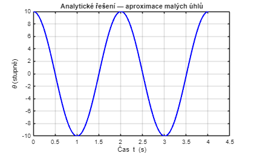
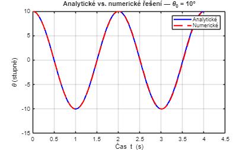
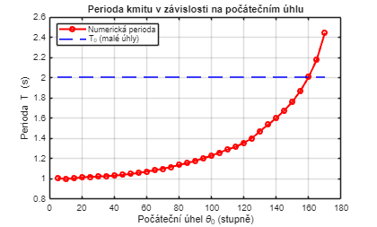
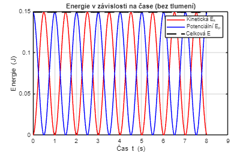
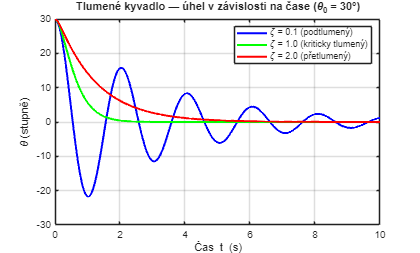
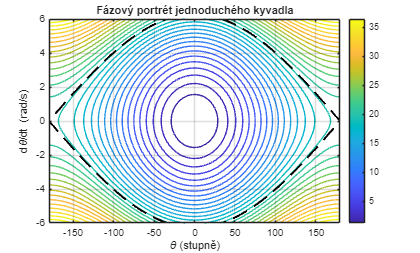

[](https://matlab.mathworks.com/open/github/v1?repo=JanStudnicka/zdroje_pro_vyuku&file=fyzika_kyvadla/fyzika_kyvadla.m&focus=true)
# Fyzika Kyvadla

Tento skript zkoumá pohyb jednoduchého kyvadla — od aproximace malých úhlů po plnou nelineární dynamiku — pomocí analytických řešení, numerické simulace a vizualizace.

# Model Jednoduchého Kyvadla

Jednoduché kyvadlo se skládá z hmotného bodu o hmotnosti $m$ zavěšeného na bezhmotné tyči délky $L$. Jedinou obnovující silou je tečná složka tíhy.


Aplikací druhého Newtonova zákona podél oblouku získáme **rovnici pohybu**:

 $$ mL\ddot{\theta} =-mg\sin (\theta ) $$ 

Po vydělení hodnotou $mL$ dostaneme kanonickou nelineární ODE:

 $$ \ddot{\theta} +\frac{g}{L}\sin (\theta )=0 $$ 

kde $\theta$ je úhlové vychýlení od svislé polohy, $g=9,81\,{\textrm{m/s}}^2$ a $L$ je délka kyvadla.

# Aproximace Malých Úhlů

Pro malé úhly ( $\theta \ll 1\,\textrm{rad}$ ) platí aproximace $\sin (\theta )\approx \theta$, která zjednodušuje ODE na **harmonický oscilátor**:


 $\ddot{\theta} +\omega_0^2 \,\theta =0$, kde $\omega_0 =\sqrt{g/L}$ 


Analytické řešení má tvar:

 $$ \theta (t)=\theta_0 \cos (\omega_0 t) $$ 

a **perioda** kmitu je:

 $$ T_0 =2\pi \sqrt{\frac{L}{g}} $$ 

Perioda $T_0$ závisí pouze na délce $L$ — nezávisí na hmotnosti ani na počátečním úhlu (v oblasti malých výchylek).


```matlabTextOutput
omega0 = 3.1321
```

# Perioda Kmitu

Z úhlové frekvence $\omega_0$ vypočítáme periodu $T_0$ pro kyvadlo délky $L=1\,\textrm{m}$.


```matlabTextOutput
T0 = 2.0061
```

# Analytické Řešení (Aproximace Malých Úhlů)

Pro $\theta_0 =10°$ vykreslíme analytické řešení aproximace malých úhlů v průběhu dvou celých period.


# Numerické Řešení — Plná Nelineární ODE

Pro velké amplitudy řešíme plnou nelineární ODE metodou `ode45`. Rovnici druhého řádu přepíšeme jako soustavu dvou rovnic prvního řádu:

 $$ \dot{\theta} =\omega $$ 

 $$ \dot{\omega} =-\frac{g}{L}\sin (\theta ) $$ 
# Porovnání Analytického a Numerického Řešení

Pro malé úhly se obě křivky prakticky překrývají. Rozdíl roste se zvětšující se amplitudou $\theta_0$.


# Závislost Periody na Počátečním Úhlu

Vzorec $T_0 =2\pi \sqrt{L/g}$ **podhodnocuje** skutečnou periodu pro větší amplitudy. Numericky měříme periodu pro $\theta_0$ od $5°$ do $170°$.


# Analýza Energie

Celková mechanická energie kyvadla bez tlumení je zachována:

 $$ E=E_k +E_p =\frac{1}{2}mL^2 {\dot{\theta} }^2 +mgL(1-\cos \theta ) $$ 

Pro $m=1\,\textrm{kg}$ numericky ověříme zachování energie.


# Tlumené Kyvadlo

V praxi způsobuje odpor vzduchu a tření **tlumení** úměrné úhlové rychlosti:

 $$ \ddot{\theta} +\frac{b}{mL^2 }\dot{\theta} +\frac{g}{L}\sin (\theta )=0 $$ 

Definujeme poměrný útlum $\zeta =b/(2mL^2 \omega_0 )$ a porovnáme tři režimy:

-  **Podtlumený** ( $\zeta <1$ ): kmity s klesající amplitudou 
-  **Kriticky tlumený** ( $\zeta =1$ ): nejrychlejší návrat do klidu bez kmitání 
-  **Přetlumený** ( $\zeta >1$ ): pomalý exponenciální návrat, bez kmitání 


# Fázový Portrét

**Fázový portrét** zobrazuje úhlovou rychlost $\dot{\theta}$ v závislosti na úhlu $\theta$ a odhaluje globální strukturu dynamiky kyvadla.

-  Uzavřené křivky = ohraničené kmity 
-  Otevřené křivky = plné otáčení (kyvadlo „přejde přes vrchol") 
-  **Separatrix** (přerušovaně) tvoří energetickou hranici mezi oběma režimy. 


# Shrnutí

Klíčové poznatky z tohoto cvičení:

-  Pro $\theta_0 <15°$ je aproximace malých úhlů přesná na cca 1 % 
-  Perioda kmitu roste s amplitudou a diverguje pro $\theta_0 \to 180°$ 
-  Mechanická energie je zachována v ideálním (netlumeném) kyvadle 
-  Poměrný útlum $\zeta$ určuje, zda kyvadlo kmitá nebo se monotónně vrátí do klidu 
-  Separatrix fázového portrétu při $E=2mgL$ odděluje kmitavý a rotační pohyb 

*Výukový materiál — Fyzika kyvadla. Vytvořeno v MATLAB R2025a.*

